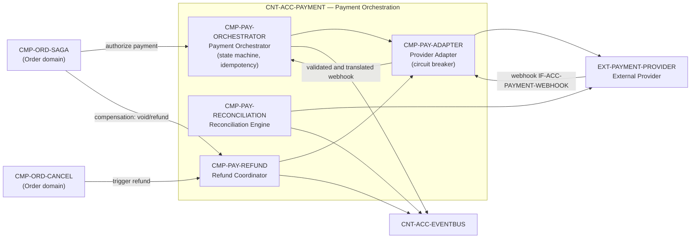

# CNT-ACC-PAYMENT — Component Diagram

```mermaid
flowchart LR
    SAGA["CMP-ORD-SAGA\n(Order domain)"]
    CANCEL["CMP-ORD-CANCEL\n(Order domain)"]
    EXT_PAY["EXT-PAYMENT-PROVIDER\nExternal Provider"]
    EVENTBUS["CNT-ACC-EVENTBUS"]

    subgraph PAY["CNT-ACC-PAYMENT — Payment Orchestration"]
        ORCH["CMP-PAY-ORCHESTRATOR\nPayment Orchestrator\n(state machine, idempotency)"]
        ADAPT["CMP-PAY-ADAPTER\nProvider Adapter\n(circuit breaker)"]
        RECON["CMP-PAY-RECONCILIATION\nReconciliation Engine"]
        REFUND["CMP-PAY-REFUND\nRefund Coordinator"]
    end

    %% Triggers
    SAGA -->|authorize payment| ORCH
    CANCEL -->|trigger refund| REFUND
    SAGA -->|compensation: void/refund| REFUND

    %% Internal
    ORCH --> ADAPT
    REFUND --> ADAPT

    %% External provider
    ADAPT --> EXT_PAY
    EXT_PAY -->|webhook IF-ACC-PAYMENT-WEBHOOK| ADAPT
    ADAPT -->|validated and translated webhook| ORCH

    %% Reconciliation
    RECON --> EXT_PAY

    %% Events
    ORCH --> EVENTBUS
    REFUND --> EVENTBUS
    RECON --> EVENTBUS
```
